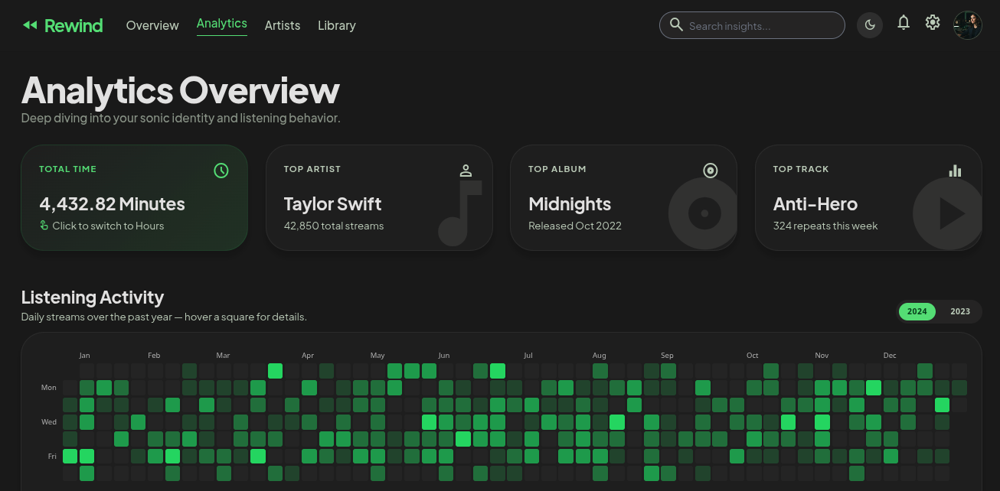

# 🎵 Rewind

**A fast, privacy-first Spotify listening data analytics & visualization dashboard.**

Rewind allows you to go beyond Spotify Wrapped's once-a-year snapshot. By connecting your account or uploading your full Spotify **Extended Streaming History** export, Rewind transforms raw listening logs into deep insights, interactive visual trends, and comprehensive analytics.

---

## 📸 Overview Dashboard



---

## ✨ Key Features & Insights

- **⏱️ Total Listening Time** — Discover the total time spent streaming music, converted cleanly into hours, days, and minutes.
- **🏆 Top Highlights** — See your top artist, top album, and top track across your history.
- **🟩 Listening Heatmap** — GitHub-style daily activity map to spot streaming trends, peak music days, and listening streaks.
- **🚫 Most Skipped / "Hated"** — Track the artists and songs you skip most frequently.
- **📊 Listening Breadth** — View total unique songs played and active listening days.

---

## 🏗️ How It Works (High-Level Architecture)

Rewind is built with a lightweight frontend and an ultra-fast analytical data backend:

```
┌─────────────────────────┐         HTTP / JSON API        ┌─────────────────────────┐
│     Vanilla JS UI       │  ───────────────────────────►  │     FastAPI Backend     │
│   (Tailwind CSS + Vite) │                                │  (DuckDB + SQLAlchemy)  │
└─────────────────────────┘                                └─────────────────────────┘
```

1. **Lightweight Frontend UI**
   - Built with **Vanilla HTML/JS** and **Tailwind CSS** for maximum speed and zero heavy framework bloat.
   - Styled with a sleek, Spotify-inspired dark aesthetic (`#121212` dark theme and Spotify Green accents).

2. **Analytical Data Engine (Backend)**
   - Powered by **FastAPI** and **DuckDB** — an in-process analytical database designed specifically for lightning-fast queries over large datasets (such as years of raw JSON streaming logs).
   - Session-scoped processing keeps data isolated and fast without complex server management.

---

## 🛠️ Tech Stack

- **Frontend:** HTML5, Vanilla JavaScript, Tailwind CSS, Vite, Chart.js
- **Backend:** Python, FastAPI, Uvicorn, DuckDB, SQLAlchemy Core
- **Package Management:** `uv` (Python dependency management)

---

## 🚀 Getting Started

### 1. Backend Setup
```bash
# Navigate to the backend directory
cd backend

# Install dependencies using uv
uv sync

# Run the FastAPI server
uv run uvicorn main:app --reload
```
The API server will run at `http://127.0.0.1:8000`.

### 2. Frontend Setup
```bash
# From the project root, install frontend dependencies
npm install

# Run the Vite development server
npm run dev
```
Open `http://localhost:5173` in your browser.
