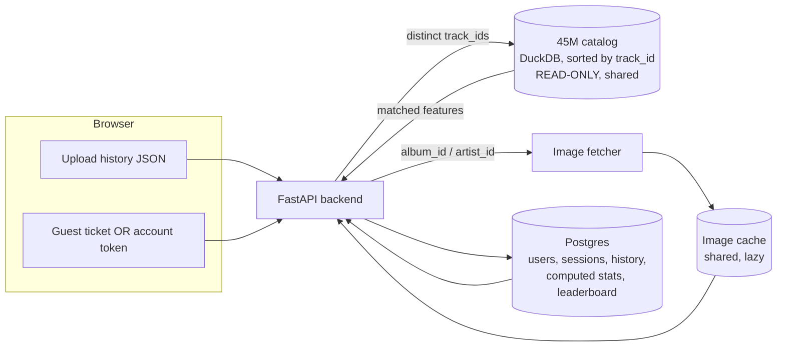
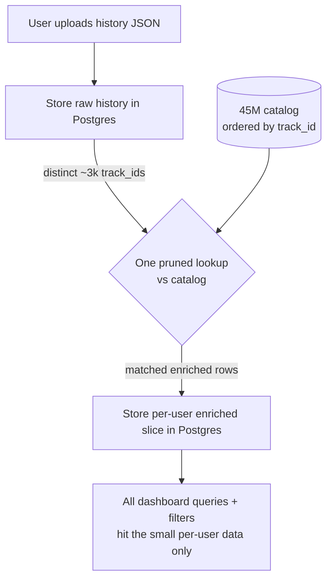

# Rewind — Target Architecture Plan

> Status: **planning / brainstorm** (not yet implemented). This is the agreed direction for
> turning Rewind into a multi-user Spotify-Wrapped-style analytics app powered by a local
> 45M-track metadata catalog. Nothing in this doc is wired up yet — it's the blueprint.

## 1. Vision

- Users upload their **Spotify Extended Streaming History** (JSON export).
- We enrich each listened track with **audio features, genre, popularity, release year** from a
  local **45M-track catalog** (no external metadata API needed for features).
- We fetch **cover art / images** on demand (the catalog has none) and cache them shared across users.
- The dashboard supports **filters and date ranges**, so raw history is stored (not just precomputed).
- **Two user tiers:** anonymous *guests* (temporary, private) and *accounts* (persistent, leaderboard, future features).

## 2. High-level shape

Three storage layers, each doing the job it's best at:

| Layer | Store | Access | Why |
|---|---|---|---|
| **Catalog** (45M tracks) | DuckDB file (or Parquet), sorted by `track_id` | **read-only, shared** | Static, huge, read-heavy — DuckDB excels at reads |
| **User data** (uploads, stats) | **Postgres** | many concurrent writes | Many users upload at once — Postgres handles concurrent writers |
| **Image cache** | Postgres table (shared) | lazy writes, shared reads | Covers are universal; fill once, reuse for everyone |

---

## 3. The 45M metadata catalog

### 3.1 What we have (verified)
- **Working catalog (in repo):** `data/metadata/catalog_sorted.parquet` — single file, **7.5 GB**,
  **45,059,660 rows**, `track_id`-ordered, 367 non-overlapping row groups. This is what the app reads.
- **Original source (backup):** the 3-part `train-0000{0,1,2}-of-00003.parquet` (8.9 GB, popularity-ordered)
  now lives off-repo at `/mnt/C/rewind_build/` as the cold rebuild source.
- One consolidated file is fine — HuggingFace's 3-way split is just download sharding; DuckDB reads one
  file or many identically, and the **367 row groups (not files)** drive parallelism + pruning.
- Source dataset: HuggingFace `GD-Studio/embeat_45m_spotify_tracks`.
- Columns:
  `track_id, track_name, isrc, popularity, explicit, artist_idx, artist_id, artist_name,
   artist_popularity, artist_genres, artist_genre_idx, album_id, album_name, release_year,
   duration, time_signature, tempo, key, mode, danceability, energy, loudness, speechiness,
   acousticness, instrumentalness, liveness, valence`
- **No image/cover column** (handled separately, see §5).

### 3.2 Data quirks to remember
- Join key: `track_id`. From history: `track_id = replace(track_uri, 'spotify:track:', '')`.
- `popularity` is **0–1 float** (×100 for a 0–100 scale).
- `duration` is in **seconds** (×1000 for ms).
- `release_year` is **year only** (no month/day).
- `artist_genres` is **plain comma-separated text** (e.g. `"dance pop, pop"`) — `string_split` for genre charts.
  (This means we do **not** need `artist_genre_map.json` anymore.)
- Has `album_id`, `artist_id`, `isrc` → enough to fetch images later.

### 3.3 The efficiency gotcha ⚠️ (resolved)
The **original** parquet was **sorted by `popularity` descending, NOT by `track_id`**, so a `track_id`
lookup couldn't skip any row groups and scanned the full 8.9 GB every query.
✅ **Resolved** — the working catalog above is now `track_id`-ordered (see §9 step 1), so lookups prune.

### 3.4 The fix — build the catalog once, offline
Re-materialize the catalog **physically ordered by `track_id`** so DuckDB's per-row-group min/max
"zonemaps" prune automatically. Then `WHERE track_id IN (...)` reads only the relevant row groups.

- Output: a persistent `catalog.duckdb` (or a re-sorted parquet set) ordered by `track_id`.
- Optionally add an ART index / `PRIMARY KEY (track_id)` for extra point-lookup speed
  (note: ART index is RAM-resident on open — the ordering alone may be enough).
- Open it **read-only** and `ATTACH` it into query connections → safe concurrent reads.
- Keep the original parquet as the cold rebuild source.

**Memory safety (this is what was crashing the PC):**
- Always run the build with `SET memory_limit='…'` and a `SET temp_directory='…'` so DuckDB
  **spills to disk** instead of exhausting RAM.
- Never `SELECT *` the whole thing into memory. Build via streaming
  `CREATE TABLE … AS SELECT … FROM read_parquet(...) ORDER BY track_id`.
- Do this **offline** (a one-time script), never inside a request.

---

## 4. Enrichment flow (upload → materialize slice)

The key efficiency move: **touch the 45M catalog exactly once per upload**, then never again.

1. Parse the JSON, insert rows into the user's history (Postgres).
2. Extract the **distinct** `track_id`s (~a few thousand even for heavy users).
3. Do **one** lookup against the catalog for just those ids.
4. Copy the matched enriched rows into the user's own data.
5. Every dashboard query / filter afterwards runs against that **small per-user set** — fast and isolated.
6. The 45M catalog stays read-only and uncontended.

Because we store the raw history (not just summaries), **filters and custom date ranges work**.

---

## 5. Images (the missing piece)

The catalog has **no cover art**, but every row has `album_id`, `artist_id`, `track_id`, `isrc`.
Cover art is **per-album**, and a user's history has only a few hundred unique albums → cheap + on-demand.

### 5.1 Design
- A **shared image cache** (Postgres tables), NOT attached to the 45M catalog:
  - `album_images(album_id, url, …)`
  - `artist_images(artist_id, url, …)`
- Filled **lazily**: on upload, collect the user's distinct `album_id`/`artist_id`, fetch only the
  ones not already cached, store them. Universal → every future user reuses them.

### 5.2 Sources (best first)
| Source | Auth | How | Notes |
|---|---|---|---|
| **Spotify Web API** | Client-credentials (free app, no user login) | `GET /v1/albums?ids=` (up to **20/call**), `GET /v1/artists?ids=` | Best quality + batching; we already have the IDs |
| **Spotify oEmbed** | **None** | `open.spotify.com/oembed?url=…album/{album_id}` → `thumbnail_url` | Simplest, one request per album |
| **Deezer** | **None** | `api.deezer.com/track/isrc:{isrc}` → `album.cover_xl` | Good fallback via ISRC |

Recommendation: Spotify Web API (batched by album) as primary, oEmbed/Deezer as fallback.

---

## 6. User data storage — guests vs accounts

**One pipeline, two switches.** Guests and accounts share the *entire* upload → enrich → store → filter
flow. They differ in only three things:

| | Guest (temporary) | Account (logged in) |
|---|---|---|
| Identity | random **ticket** (cookie / localStorage) | real **user ID** + auth **token** |
| Retention | **auto-deleted** after a TTL / inactivity | **kept** while the account exists |
| Leaderboard | ❌ opted out (never written) | ✅ opted in |
| Cross-device | ❌ (tied to that browser) | ✅ |

### 6.1 How "on their browser" actually works
The browser can't hold the real data (filters + enrichment need the server-side catalog & images).
So for a guest:
- Browser stores a small **random ID ticket** (like a coat-check tag).
- Real data lives **server-side (Postgres), tagged with that ID**.
- Return visit → browser presents ticket → server finds their data.
- After the TTL (or on leave) → server **deletes it**. Never hits the leaderboard.

> Fancy "maybe later" option: run DuckDB-in-the-browser (WASM) so a guest's raw history *never*
> leaves their machine — max privacy. Still needs a server trip to enrich. Not for the MVP.

### 6.2 Why Postgres for user data
DuckDB is a **single-writer** file (great reader, but simultaneous writers queue up). With many
users uploading at once, that's a bottleneck. **Postgres is built for many concurrent writers**, so
it's the right home for user/session data, computed stats, and the leaderboard.

Suggested Postgres tables (sketch):
- `users(id, email/oauth, created_at, …)`
- `sessions(id, user_id NULL for guests, is_guest, expires_at, …)`
- `history(session_id, ts, track_uri, track_name, artist_name, album_name, ms_played, … )`
- `enriched_tracks(session_id, track_id, features…, genre, release_year, popularity)`
- `computed_stats(session_id, total_ms, top_artist, …)`  ← also feeds leaderboard
- `album_images(album_id, url)`, `artist_images(artist_id, url)`  ← shared cache
- `leaderboard(user_id, metric, value, …)`  ← account users only

### 6.3 MVP shortcut
If standing up Postgres now is too much, the smallest step from today's code is **one DuckDB file per
session** (no shared-writer contention, cleanup = delete file). Swap to Postgres when traffic grows —
**the catalog doesn't change at all** when you do.

---

## 7. Leaderboard & future features (accounts only)

- Only **account** users get their `computed_stats` written into `leaderboard`.
- Guests are simply never inserted → automatic opt-out.
- Future account-gated features (comparisons, friends, history over time) hang off `user_id`.

---

## 8. Engine cheat-sheet

- **DuckDB** = spreadsheet-like file. Amazing at reading huge data fast; **only one writer at a time**.
  → perfect for the **read-only 45M catalog**.
- **Postgres** = server that manages many people at once; **many writers concurrently**.
  → perfect for **user uploads, stats, leaderboard, image cache**.

---

## 9. Build roadmap (suggested order)

1. ✅ **Catalog build (DONE)** — `notebooks/build_catalog.ipynb` re-sorts the 45M parquet by `track_id`, memory-safe (`memory_limit=2GB`, `threads=2`, spill on `/mnt/C`, never RAM or `/tmp`). Output now lives in-repo at **`data/metadata/catalog_sorted.parquet`** (single file, 7.5 GB, 45,059,660 rows, 367 non-overlapping row groups; ~11.5 min build; cold point lookup ≈ 187 ms). The original 3-part source is preserved at `/mnt/C/rewind_build/` as the rebuild backup. (Machine limits: ~2 GB free RAM, no swap, ~13 GB free on `/home`, so scratch spilled to the big NTFS mount `/mnt/C`.)
2. **Enrichment on upload**: distinct track_ids → one catalog lookup → store per-user enriched slice.
3. **Session model**: guest ticket + TTL cleanup (MVP: per-session DuckDB, or go straight to Postgres).
4. **Image cache**: lazy fetch (Spotify API primary), shared tables, keyed by album/artist id.
5. **Accounts + auth tokens**: persistent storage, then **leaderboard**.
6. **Dashboard filters/date ranges** against the per-user data.

## 10. Hard rules / safety

- ❌ Never load the 45M catalog fully into RAM. Always `memory_limit` + stream + spill to `temp_directory`.
- ❌ Never scan the raw catalog in a request path — only the offline build and the one per-upload lookup.
- ✅ Catalog is **read-only + shared**. User data is **per-session/user + writable** (Postgres).
- ✅ Images: fetch once, cache shared, keyed by album/artist id.

## 11. Open decisions

- User-data store now: **Postgres** (target) vs **per-session DuckDB** (MVP shortcut)?
- Auth: email/password vs OAuth (e.g., Google/Spotify login)?
- Guest TTL: how long before auto-delete (e.g., 24h inactivity)?
- Catalog: **currently a single re-sorted Parquet** (`data/metadata/catalog_sorted.parquet`). Later, optionally promote to an indexed DuckDB table (`PRIMARY KEY (track_id)`) for faster scattered bulk lookups — best on a box with more RAM.
